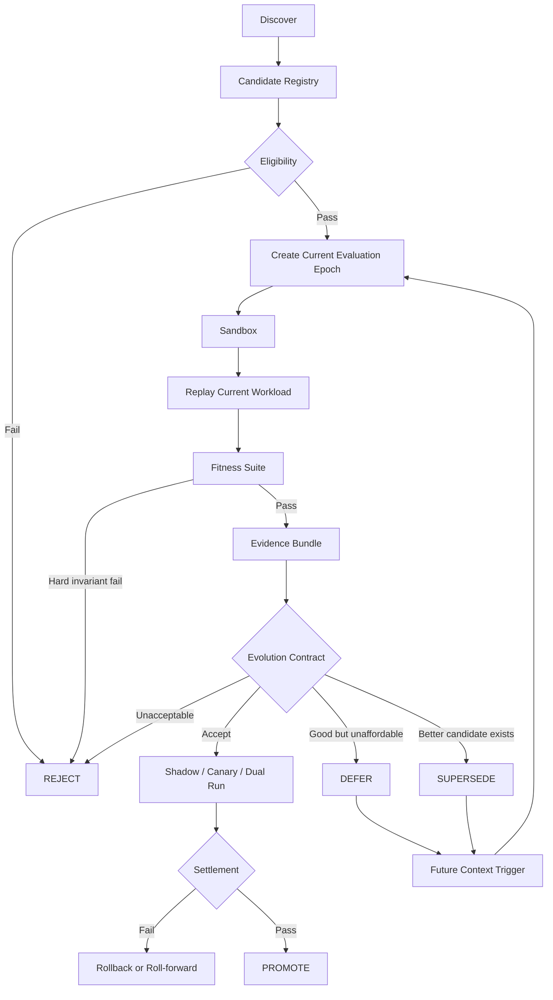
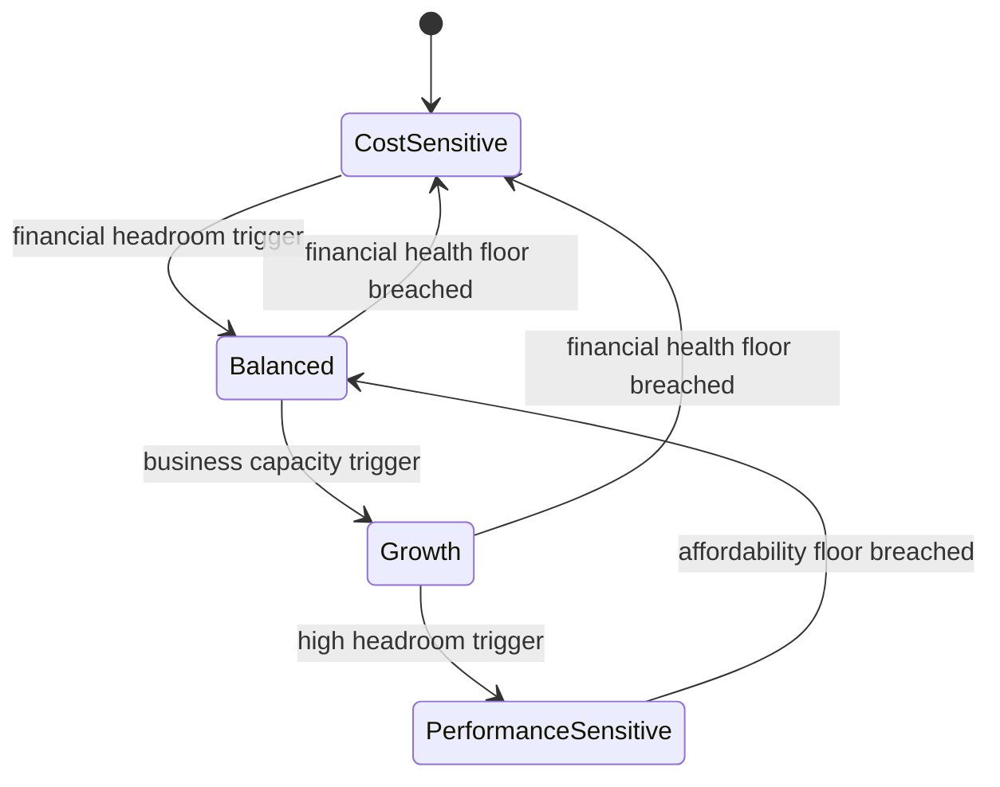

# Fitness Self-Driven Evolutionary Data Plane

**Status:** Draft  
**Categoria:** AllasCode Data Architecture  
**Nome curto:** FSEDP

## Definição

**Fitness Self-Driven Evolutionary Data Plane** é um Data Plane cuja realização física pode ser continuamente descoberta, experimentada, comparada, adiada, promovida, revertida e substituída por mecanismos alternativos, desde que cada decisão seja sustentada por evidência verificável produzida no contexto corrente e satisfaça um Evolution Contract versionado sem violar o Semantic Contract vigente.

O FSEDP compõe conceitos já estabelecidos — evolutionary architecture, architectural fitness functions, evolutionary database design, self-driving/autonomic databases, ports & adapters, policy-as-code, workload replay, chaos engineering, provenance e FinOps — e desloca a fronteira de autonomia: a unidade evolutiva deixa de ser apenas a configuração interna de um DBMS e passa a incluir a própria realização física do Data Plane.

A tese central é:

```text
Physical implementation may evolve autonomously
AND
semantic observables remain invariant
```

sob a regra:

```text
Decision in context K
requires Evidence produced for context K
```

## Princípio fundamental

```text
Meaning != Policy != Mechanism
```

- **Semantic Contract** define o significado que deve permanecer verdadeiro.
- **Evolution Contract** define quais trade-offs podem ser aceitos no contexto corrente.
- **Effect / Port** expressa a obrigação semântica.
- **Adapter** realiza essa obrigação utilizando uma tecnologia concreta.
- **Physical Data Technology** é substituível.
- **Fitness Suite** mede propriedades relevantes.
- **Evidence Bundle** sustenta afirmações sobre uma avaliação.
- **Candidate Registry** mantém candidatos e seu histórico de avaliações.
- **Promotion Controller** altera a implementação física somente após decisão autorizada.

A tecnologia não define o significado.

## Fronteira semântica

Durante uma Evaluation Epoch:

```text
Semantic Contract = immutable
Evolution Contract = immutable version
Physical Implementation = evolvable
```

Formalmente:

```text
S_v = constant during evaluation
```

Uma mudança semanticamente incompatível exige nova versão:

```text
S_v -> S_v+1
```

Uma nova versão semântica inicia uma nova Evaluation Epoch.

Isso evita comparar duas tecnologias enquanto o próprio significado que elas deveriam preservar está mudando.

## Adapter e Effect

```text
Semantic Contract
       |
       v
    Effect
       |
       +---- Adapter PostgreSQL
       +---- Adapter A
       +---- Adapter B
       +---- Adapter X
```

A Fitness Suite não pergunta:

```text
PostgreSQL == Database-X ?
```

Ela pergunta:

```text
implements(Adapter-X, Effect-Y) ?
preserves(Adapter-X, SemanticContract-v) ?
```

Somente depois pergunta:

```text
is Adapter-X better than current Adapter
under EvolutionContract-v
in EvaluationEpoch-t ?
```

Equivalência não significa apenas retornar os mesmos registros. Conforme o contrato, deve incluir semântica de erro, ordering, consistency, durability, isolation, idempotency, temporalidade, failure semantics e pós-condições do domínio.

## Evaluation Context

Para uma Evaluation Epoch `t`:

```text
S_v = semantic contract
P_v = evolution contract
A_t = current active implementation
C_t = eligible candidates
W_t = current workload
E_t = current execution environment
D_t = current representative data state
B_t = current business/financial state
```

O contexto é materializado em um manifesto canônico:

```text
K_t = canonical(
  S_v,
  P_v,
  A_t,
  Candidate,
  W_t,
  E_t,
  D_t,
  B_t,
  EvaluationWindow
)

context_fingerprint = SHA256(K_t)
```

Uma evidência é admissível apenas quando pertence ao contexto corrente:

```text
Admissible(e,t) =
  SignatureValid(e)
  AND e.context == context_fingerprint(t)
  AND e.epoch == t
  AND EvaluationComplete(e)
```

### Regra temporal da evidência

Evidência histórica permanece válida como história, aprendizado, descoberta e análise longitudinal, mas não autoriza uma decisão corrente.

```text
historical evidence
    -> discovery
    -> learning
    -> trend analysis
    -X-> current authorization
```

Quando o contexto não corresponde, a classificação correta é:

```text
NOT_APPLICABLE
```

Não necessariamente `INVALID` e não necessariamente `STALE`.

Uma evidência antiga pode continuar perfeitamente correta para o contexto no qual foi produzida; ela apenas não constitui prova para o contexto atual.

## Evaluation Epoch

“Momento atual” não significa instante matemático. Benchmarking exige uma janela de observação.

Uma **Evaluation Epoch** congela um manifesto de contexto para permitir comparação justa entre baseline e candidato.

Se workload, contrato, ambiente, versão do candidato, dataset representativo ou estado econômico mudarem materialmente, a época deve ser invalidada e uma nova avaliação deve começar.

## Baseline

O candidato nunca compete contra uma configuração artificialmente fraca.

Ele compete contra o **Current Best Baseline**.

```text
Current Technology
      |
      v
Current Self-Tuning
      |
      +-- knobs
      +-- indexes
      +-- partitioning
      +-- materializations
      +-- batching
      +-- storage layout
      +-- connection strategy
      +-- allowed extensions
      |
      v
Current Best Baseline
```

Portanto, no Postgres Mode, por exemplo, um banco candidato deve competir contra o melhor PostgreSQL que o próprio sistema conseguiu produzir para aquele contexto.

## Fontes externas

Fontes externas podem descobrir candidatos:

```text
paper
benchmark público
repositório
catálogo
vendor page
        |
        v
Candidate Registry
```

Mas resultados externos nunca entram como Fitness Evidence:

```text
External Benchmark -X-> Promotion Decision
```

Toda evidência utilizada para promoção deve ser produzida pelo Evaluation Plane no workload e no contexto correntes.

## Fitness Vector

O resultado de avaliação deve permanecer multidimensional:

```text
F(candidate, context) = [
  semantic,
  technical,
  replaceability,
  schema,
  ownership,
  coupling,
  distributed_invariants,
  data_age,
  data_quality,
  technology_maturity,
  economic,
  affordability,
  reversibility
]
```

A decisão não deve reduzir prematuramente esse vetor a um único score.

Um score escalar cedo demais permite que uma melhoria em performance “compense” matematicamente uma violação que deveria ser inegociável.

## Decision Order

```text
Hard Invariants
      |
      v
Constraints
      |
      v
Evidence Sufficiency
      |
      v
Economic Fitness
      |
      v
Affordability
      |
      v
Multi-objective Comparison
      |
      v
Reversibility
      |
      v
Decision
```

A decisão é constrained multi-objective, não uma média cega.

## Fitness Classes

### 1. Semantic Fitness

Protege equivalência observável de domínio.

```text
SemanticEquivalent(candidate, S_v) == true
```

Pode validar:

- pré-condições;
- pós-condições;
- invariantes;
- efeitos permitidos;
- ordering;
- consistency;
- durability;
- idempotency;
- failure semantics;
- temporal semantics;
- canonical outcomes.

### 2. Database Replaceability Fitness

Objetivo: provar que uma tecnologia pode ser adicionada, removida ou substituída sem alterar a semântica do sistema.

```text
F_replace(adapter) =
  SemanticEquivalent(adapter)
  AND ContractCompliant(adapter)
  AND TransitionSafe(adapter)
```

A mesma suite de contrato deve ser executada contra todos os adapters.

### 3. Technical Fitness

Mede pelo menos:

- latency p50/p95/p99;
- throughput;
- error rate;
- CPU;
- memory;
- I/O;
- storage;
- saturation;
- availability;
- recovery behavior.

Baseline e candidato devem usar ambiente equivalente, dataset equivalente, workload equivalente e metodologia reproduzível.

### 4. Schema Evolution Fitness

```text
Compat(S_i, S_i+1, policy)
AND
SemanticPreservation
```

Forward e backward compatibility devem ser exigidas quando declaradas pelo contrato, não como dogma universal.

Exemplos de transformações que podem precisar ser bloqueadas:

```text
remove required property
reinterpret semantic type
reuse event version
change invariant meaning
change ownership meaning
```

### 5. Data Ownership Fitness

Uma infraestrutura física compartilhada não implica ownership semântico compartilhado.

```text
Write(actor, data)
=>
Owner(actor) == Owner(data)
OR AuthorizedEffect(actor, data)
```

Métricas possíveis:

```text
direct_cross_domain_writes = 0
undeclared_table_access = 0
ownership_violations = 0
```

### 6. Data Coupling / Change Propagation Fitness

O objetivo não é simplesmente contar dependências, mas medir blast radius de mudança.

```text
BlastRatio =
  AffectedRelevantArtifacts / RelevantArtifacts
```

Também deve considerar dependências transitivas.

A fitness deve detectar acoplamento emergente que não foi declarado intencionalmente.

### 7. Distributed Invariants Fitness

O foco não é perguntar “a transação distribuída terminou?”.

O foco é perguntar:

```text
os invariantes sobreviveram às falhas?
```

Deve testar cenários como:

- process crash;
- timeout;
- duplicate delivery;
- reordered delivery;
- retry;
- network partition;
- broker restart;
- interrupted cutover;
- leader loss;
- partial migration.

Regras possíveis:

```text
invariant_violations = 0
duplicate_business_effects = 0
lost_critical_events = 0
invalid_terminal_states = 0
```

E, quando houver settlement assíncrono:

```text
SettlementTime_p99 <= SLA
```

### 8. Data Age / Freshness Fitness

Quando relógios são semanticamente comparáveis:

```text
Age = ObservationTime - SourceTime
```

Quando não são, usar lag baseado em watermark, offset ou outra referência monotônica.

Exemplo de SLA:

```text
CustomerSummary:
  p50 < 100ms
  p95 < 300ms
  p99 < 1s
```

`Absent`, `Stale` e `Failed` são estados distintos.

### 9. Data Quality Fitness

Qualidade é multidimensional e contextual.

Uma composição inicial é:

```text
[
  completeness,
  validity,
  consistency,
  uniqueness,
  accuracy,
  freshness,
  provenance
]
```

Cada domínio declara quais dimensões são invariants, constraints ou objectives.

### 10. Technology Maturity Fitness

Maturity representa risco operacional, não popularidade.

Pode considerar:

```text
maintenance
security response
upgrade path
backup/restore
recovery behavior
license constraints
artifact provenance
operator complexity
adapter completeness
```

Uma tecnologia pouco conhecida pode ser promovida quando demonstrar risco aceitável para o contrato vigente.

```text
popularity != fitness
```

### 11. Economic Fitness

Economic Fitness mede valor marginal esperado da mutação.

```text
ExpectedValue =
  DeltaRevenue
+ DeltaRetentionValue
+ DeltaCapacityValue
+ DeltaAvoidedCost
+ DeltaRiskAvoided
- DeltaOperationalCost
- MigrationCost
- ExpectedRecoveryCost
```

Uma mutação não precisa trazer novos usuários para criar valor. Ela pode:

- aumentar conversão;
- reduzir churn;
- aumentar ARPU;
- suportar SLA premium;
- ampliar capacidade;
- evitar custos futuros;
- reduzir risco;
- reduzir trabalho operacional.

### 12. Affordability Fitness

Uma mutação economicamente positiva pode ser financeiramente inviável no momento.

```text
Profitable != Affordable
```

Pode considerar:

```text
budget headroom
cash headroom
runway
payback
absolute additional cost
relative additional cost
```

Formalmente:

```text
Affordable(m,t) = true iff
  DeltaMonthlyCost <= BudgetHeadroom_t
  AND CashNeed <= CashHeadroom_t
  AND Payback <= EvolutionContract.MaxPayback
  AND RunwayAfter >= EvolutionContract.MinRunway
```

Os limites pertencem ao Evolution Contract vigente.

### 13. Reversibility / Recovery Fitness

Toda mutação deve declarar recovery strategy.

```text
rollback
roll-forward
restore + replay
dual-run
dual-write
reconciliation
```

Rollback não é presumido como gratuito ou sempre possível.

Uma visão útil é:

```text
R = [
  possible,
  RTO,
  RPO,
  reconciliation_cost,
  dual_run_cost,
  expected_recovery_cost
]
```

## Evidence Strength

Evidence deve declarar sua natureza:

```text
MEASURED
DERIVED
FORECAST
```

- **MEASURED**: resultado observado diretamente no experimento.
- **DERIVED**: resultado calculado a partir de valores medidos.
- **FORECAST**: efeito futuro estimado/modelado.

Uma redução de latência pode ser medida. O impacto futuro dessa redução em receita não pode ser apresentado como fato antes de validação causal adequada.

## Incerteza experimental

Uma execução única não prova otimização.

Resultados quantitativos devem declarar repetição, variância, distribuição, effect size e alguma medida explícita de incerteza.

Uma Promotion Policy pode exigir:

```text
P(improvement >= minimum_effect | evidence)
>= required_confidence
```

O nível de confiança pertence ao Evolution Contract e não deve ser hard-coded universalmente.

## Candidate Registry

Candidate e Evaluation são entidades distintas.

```text
Candidate
  identity
  technology
  version
  adapter
  discovery_metadata

Evaluation
  candidate
  epoch
  context_fingerprint
  evidence_bundle
  decision
```

O mesmo candidato pode possuir decisões diferentes em contextos diferentes:

```text
DB-X @ 1.3
  |- Eval k1 -> REJECTED
  |- Eval k2 -> DEFERRED
  `- Eval k3 -> PROMOTED
```

Isso não é contradição. Cada decisão pertence ao seu contexto.

## Decisions

### PROMOTED

Passou pelas gates aplicáveis e completou promotion/settlement. Torna-se baseline corrente.

### DEFERRED

Possui valor potencial, mas uma condição contextual impede promoção corrente.

Um trigger futuro pode recolocá-lo na fila, porém uma nova Evaluation Epoch deve produzir nova Evidence.

### REJECTED

Não satisfaz o contrato na Evaluation Epoch avaliada.

Não significa rejeição eterna da tecnologia.

### SUPERSEDED

Outra alternativa passou a ser preferível, ou a versão/avaliação perdeu relevância.

## Candidate Lifecycle



Nenhuma reavaliação reutiliza Evidence histórica como autorização.

## Modes

Os modes controlam o **search space**.

O Evolution Contract controla a **decision policy**.

```text
mode -> search space
evolution contract -> decision policy
```

### Postgres

O conjunto de candidatos é restrito ao PostgreSQL e às transformações explicitamente permitidas sobre ele.

Pode incluir:

- knobs;
- indexes;
- partitioning;
- materialized views;
- batching;
- storage layout;
- connection strategy;
- approved extensions.

### Stable Polyglot

O conjunto de candidatos é restrito a uma allowlist de tecnologias/adapters aprovados.

O objetivo é especialização com risco operacional controlado.

### Evidence-Optimized

Popularidade não restringe o conjunto de candidatos.

Qualquer implementação compatível pode ser candidata, inclusive pouco conhecida, desde que passe por:

```text
eligibility
security
semantic contracts
fitness suite
evidence requirements
promotion policy
recovery requirements
```

O vencedor pode continuar sendo PostgreSQL. Isso não é falha do modo; é evidência de que ele continua sendo a melhor realização para o contexto corrente.

## Evolution Contract

Evolution Contracts são versionados e imutáveis depois de publicados.

Uma mudança de objetivos cria uma nova versão ou ativa outro contrato.

Triggers não editam silenciosamente o contrato vigente.



Exemplo:

```text
CostSensitive@1.4.0
        |
        | trigger
        v
Growth@2.0.0
```

A transição deve gerar audit trail contendo pelo menos:

```text
old_contract_digest
new_contract_digest
trigger_evidence
transition_policy
authorized_by
activated_at
```

Evidence produzida sob um contrato anterior torna-se `NOT_APPLICABLE` para autorização sob o novo contrato.

## Promotion Safety

Uma promoção deve preservar pelo menos:

```text
Semantic Contract valid
AND Authorization valid
AND Evidence current
AND Context fingerprint valid
AND Safety invariants valid
AND Evolution Contract satisfied
AND Recovery strategy available
```

O contrato pode classificar a autoridade necessária por risco:

```text
autonomous
human_approval_required
forbidden
```

Self-Driven significa autonomia dentro de um espaço de ações autorizado, não liberdade para redefinir arbitrariamente os próprios objetivos.

## Evolution Control Plane

A experimentação deve ser separada do Data Plane de produção.

```text
                    EVOLUTION CONTROL PLANE

Current Telemetry ---> Context Capture
                            |
Candidate Registry ---------+
                            v
                     Evaluation Sandbox
                            |
                     Workload Replay
                            |
                       Fitness Engine
                            |
                       Evidence Store
                            |
                  Evolution Policy Engine
                            |
                    Promotion Controller
                            |
                            v

                   PRODUCTION DATA PLANE

Semantic Effect
      |
      v
Current Adapter
      |
      v
Current Physical Store
```

Essa separação reduz interferência entre experimento e sistema medido e permite governança específica para promoção.

## Workload Replay

O workload utilizado em decisão deve representar o contexto corrente.

Um workload fingerprint deve carregar mais que um hash bruto do trace.

Exemplo:

```yaml
workload:
  digest: "sha256:..."
  capture_window:
    start: "..."
    end: "..."

  characteristics:
    read_write_ratio: 0.37
    concurrency_distribution_digest: "sha256:..."
    query_shape_digest: "sha256:..."
    payload_distribution_digest: "sha256:..."
    transaction_shape_digest: "sha256:..."
```

## Evidence Bundle

O Evidence Bundle deve ser content-addressed, assinado, verificável e append-only.

Deve permitir reconstruir:

```text
o que mudou?
por que mudou?
contra o que foi comparado?
qual workload foi usado?
qual contrato julgou?
quais invariantes passaram?
quais regressões foram aceitas?
quanto custava?
qual era a saúde financeira?
qual incerteza existia?
quem/o que autorizou?
como reverter?
o que ocorreu depois do cutover?
```

Uma forma conceitual é:

```text
DecisionRecord = Hash(
  Candidate,
  Baseline,
  Context,
  FitnessResults,
  EvidenceBundle,
  EvolutionContract,
  PromotionAction
)
```

## Safety invariants mínimos

Um núcleo recomendável é:

```text
Semantic contract preserved
AND No unauthorized data mutation
AND Critical data loss within declared RPO
AND No duplicate business effect
AND Required provenance complete
AND Evidence belongs to current Evaluation Epoch
AND Evolution Contract signature/version valid
AND Promotion path authorized
AND Recovery strategy executable
```

`RPO = 0` não deve ser imposto cegamente a toda classe de dado. Dados regeneráveis ou explicitamente descartáveis podem declarar outro RPO.

## Supply-chain safety

No Evidence-Optimized Mode:

```text
good workload fitness
!=
permission to execute arbitrary binary
```

Todo candidato deve ter identidade, digest, provenance e política de execução antes de entrar no sandbox ou ser promovido.

## Self-Tuning, Self-Optimizing e Self-Evolving

```text
Self-Tuning
DB atual
 -> configura melhor o mesmo DB

Self-Optimizing
Data Plane atual
 -> procura uma realização física melhor

Self-Evolving
Data Plane
 -> mantém candidatos
 -> experimenta
 -> produz evidence
 -> muda composição
 -> reavalia decisões
 -> adapta decision policy por contract versioning
```

## Relação com conceitos existentes

O FSEDP não deve ser apresentado como ideia isolada. Sua força está na composição e no deslocamento da unidade evolutiva.

| Conceito | O que já resolve | O que o FSEDP reutiliza | Diferença relevante |
|---|---|---|---|
| Evolutionary Architecture | Mudança guiada e incremental por fitness functions | Fitness Suite e constraints executáveis | Aplica fitness à seleção da realização física do Data Plane |
| Evolutionary Database Design | Schema/data evolution incremental | migrations, compatibility, expand/contract | Não é apenas método de migration; integra decisão autônoma de infraestrutura |
| Ports & Adapters | Isola domínio de tecnologia externa | Adapter/Effect como fronteira | Adiciona avaliação e promoção evidence-driven |
| Autonomic Computing | Self-management segundo objetivos superiores | feedback loop governado | Especializa o loop para Data Plane com semantic/economic fitness |
| Self-Driving DBMS | Ajuste autônomo de um DBMS | observation/action/feedback | Amplia action space para cross-engine e composição física |
| OtterTune / auto-tuning | Otimização de knobs por workload | baseline self-tuning | Não limita a evolução a parâmetros internos do DBMS |
| Database Gyms / MLOS | Experimentação reprodutível e tuning | Evolution Sandbox | Adiciona semantic contract, economics e cross-engine promotion |
| Polyglot Persistence | Uso de múltiplos stores | candidate space especializado | Torna a composição candidata a evolução contínua |
| Policy-as-Code | Política declarativa versionada | Evolution Contract | Acopla policy a evidence contextual e promotion lifecycle |
| Chaos Engineering | Validação sob condições adversas | Distributed Invariants Fitness | Usa resultado como gate de promoção |
| Workload Replay | Reprodução de workload real | benchmark local obrigatório | Generaliza para comparação de adapters heterogêneos |
| FinOps | Relação custo/valor | Economic + Affordability Fitness | Integra saúde financeira diretamente à evolução arquitetural |
| SLSA / in-toto / OpenLineage | Provenance e attestations | Evidence Bundle | Usa provenance como parte de uma decisão evolutiva |

## Posicionamento e hipótese de contribuição

Não é novidade por si só:

- usar vários bancos;
- escolher banco por workload;
- auto-tuning;
- policy-as-code;
- workload replay;
- chaos testing;
- FinOps;
- provenance.

A hipótese de contribuição do FSEDP está na composição:

```text
SemanticContract
+
Adapter/Effect
+
CurrentContextReplay
+
FitnessSuite
+
EvidenceBundle
+
EvolutionContract
+
CandidateLifecycle
+
SafePromotion
```

A diferença de unidade evolutiva pode ser resumida assim:

```text
Self-driving DBMS:
  optimize(DBMS)

FSEDP:
  select/evolve(
    PhysicalDataPlane
    | SemanticContract,
      CurrentContext,
      EvolutionContract
  )
```

A afirmação de ineditismo absoluto ainda exige revisão sistemática específica de adaptive database selection, autonomic polyglot persistence, self-evolving data platforms e cross-engine migration.

## Agentes como gestores cognitivos do sistema

A visão futura do AllasCode não limita Agents a converter Intents em resultados.

Agents podem atuar como gestores cognitivos do sistema dentro dos contratos vigentes:

```text
observe
-> hypothesize
-> discover candidate
-> plan experiment
-> execute sandbox evaluation
-> interpret fitness evidence
-> justify trade-off
-> propose promotion/defer/reject
-> execute authorized migration
-> monitor settlement
-> trigger rollback/roll-forward when required
-> learn from historical evidence
```

A cognição não substitui invariantes, contratos ou evidência.

Ela opera dentro deles.

```text
Cognition proposes and reasons.
Contracts constrain.
Fitness measures.
Evidence justifies.
Policy decides.
Runtime enforces.
```

Esse é o ponto em que o Data Plane deixa de ser somente infraestrutura passiva e passa a ser um sistema gerenciado cognitivamente, sem abrir mão de verificabilidade e governança.

## Riscos e ameaças à validade

### Goodhart's Law / Fitness Gaming

Quando uma métrica vira objetivo, o sistema pode otimizá-la degradando propriedades não medidas.

Mitigações:

- hard invariants;
- vetor multiobjetivo;
- métricas redundantes;
- holdout scenarios;
- adversarial fitness cases;
- auditoria humana para mudanças críticas.

### Workload / Concept Drift

Workloads mudam.

Mitigação: Evidence é vinculada a Evaluation Epoch e context fingerprint.

### Unsafe Exploration

Exploração automática de candidatos pode causar dano.

Mitigação: sandbox, shadow, canary, dual-run, risk-class authorization e promotion gates.

### Semantic Equivalence Incompleta

Duas tecnologias podem parecer equivalentes em happy path e divergir em failures, consistency ou ordering.

Mitigação: contract/property/model tests e fault injection.

### Irreversibilidade

Migração cross-engine pode exigir reconciliação e roll-forward, não simples rollback.

Mitigação: recovery strategy obrigatória e custo de recovery dentro da fitness.

### Causalidade econômica

Correlação entre melhoria técnica e resultado comercial não prova causalidade.

Mitigação: marcar business impact como FORECAST até validação adequada.

### Supply Chain

Tecnologia pouco conhecida pode apresentar risco de artefato, manutenção ou segurança.

Mitigação: provenance, digest, eligibility gates e Technology Maturity Fitness.

### Feedback Loops

Uma promoção pode alterar o workload que motivou a promoção.

Mitigação: settlement fitness e nova Evaluation Epoch após mudança material.

## Perguntas em aberto

1. Qual será o formato canônico do Semantic Contract aplicado a adapters de Data Plane?
2. Qual mecanismo definirá mudança material de contexto e encerramento de uma Evaluation Epoch?
3. Como será calculada representatividade mínima do workload capturado?
4. Quais classes de mutação podem ser `autonomous`, `human_approval_required` ou `forbidden`?
5. Como medir semantic equivalence quando bancos oferecem consistency models diferentes?
6. Como combinar Pareto front, prioridades lexicográficas e constraints sem esconder trade-offs?
7. Qual mecanismo de causal inference será usado para promover FORECAST econômico a MEASURED?
8. Como evitar que um Agent otimize a própria Fitness Suite ou Evolution Contract para aprovar sua proposta?
9. Como versionar e assinar Evidence Bundle, Evaluation Epoch e Evolution Contract?
10. Como implementar cross-engine shadow/dual-run de forma genérica?

## Roadmap conceitual

### Fase 1 — Postgres Mode

- formalizar Fitness Suite;
- implementar context capture;
- workload fingerprint;
- self-tuning de knobs/indexes/partitioning;
- Evidence Bundle;
- Current Best Baseline.

### Fase 2 — Stable Polyglot

- adapters especializados;
- conformance suite compartilhada;
- Candidate Registry;
- sandbox cross-engine;
- workload replay;
- shadow/dual-run;
- recovery strategies.

### Fase 3 — Evidence-Optimized

- candidate discovery;
- eligibility automation;
- Technology Maturity Fitness;
- multi-objective evaluation;
- Economic/Affordability Fitness;
- autonomous promotion por risk class.

### Fase 4 — Cognitive Management

- Agents propondo hipóteses de otimização;
- planejamento de experimentos;
- interpretação de evidências;
- reavaliação de candidatos;
- contract-governed self-evolution.

## Referências conceituais

- Neal Ford, Rebecca Parsons, Patrick Kua — *Building Evolutionary Architectures*, O'Reilly, 2017. https://www.oreilly.com/library/view/building-evolutionary-architectures/9781491986356/
- Jeffrey O. Kephart, David M. Chess — *The Vision of Autonomic Computing*, IEEE Computer, 2003. https://ieeexplore.ieee.org/document/1160055/
- Andrew Pavlo et al. — *Self-Driving Database Management Systems*, CIDR, 2017. https://www.cs.cmu.edu/~pavlo/publications.html
- Dana Van Aken et al. — *Automatic Database Management System Tuning Through Large-scale Machine Learning*, SIGMOD, 2017. https://db.cs.cmu.edu/papers/2017/p1009-van-aken.pdf
- Andrew Pavlo et al. — *Make Your Database System Dream of Electric Sheep*, PVLDB, 2021. https://www.vldb.org/pvldb/vol14/p3211-pavlo.pdf
- Pramod Sadalage, Martin Fowler — *Evolutionary Database Design*. https://martinfowler.com/articles/evodb.html
- Alistair Cockburn — *Hexagonal Architecture / Ports and Adapters*. https://alistair.cockburn.us/hexagonal-architecture
- Hector Garcia-Molina, Kenneth Salem — *Sagas*, SIGMOD, 1987. https://dl.acm.org/doi/10.1145/38713.38742
- Richard Y. Wang, Diane M. Strong — *Beyond Accuracy: What Data Quality Means to Data Consumers*, 1996. https://www.tandfonline.com/doi/abs/10.1080/07421222.1996.11518099
- Junghoo Cho, Hector Garcia-Molina — *Synchronizing a Database to Improve Freshness*, 2000. https://dl.acm.org/doi/10.1145/335191.335391
- Dominik Durner — *TracEx: Understanding and Analyzing Database Traces*, CIDR, 2024. https://www.vldb.org/cidrdb/papers/2024/p8-durner.pdf
- *Why TPC Is Not Enough: An Analysis of the Amazon Redshift Fleet*, PVLDB, 2024. https://www.amazon.science/publications/why-tpc-is-not-enough-an-analysis-of-the-amazon-redshift-fleet
- *Database Gyms*, CIDR, 2023. https://vldb.org/cidrdb/2023/database-gyms.html
- *MLOS in Action: Bridging the Gap Between Experimentation and Auto-Tuning in the Cloud*, PVLDB, 2024. https://www.microsoft.com/en-us/research/publication/mlos-in-action-bridging-the-gap-between-experimentation-and-auto-tuning-in-the-cloud/
- Open Policy Agent. https://openpolicyagent.org/docs
- Principles of Chaos Engineering. https://principlesofchaos.org/
- SLSA Provenance. https://slsa.dev/provenance
- in-toto Attestation. https://in-toto.io/attestation/link/v0.3
- OpenLineage. https://openlineage.io/
- FinOps Framework — Unit Economics. https://www.finops.org/framework/capabilities/unit-economics/
- FinOps Framework — Architecting & Workload Placement. https://www.finops.org/framework/capabilities/architecting-workload-placement/
- *A Methodology for Guiding Polyglot Persistence Design*, SBBD, 2026. https://sol.sbc.org.br/index.php/sbbd_estendido/article/view/44148
- *Architectural Evolution and Selection Framework for Database Systems in AI-Ready Data Platforms*, 2026. https://arxiv.org/abs/2606.08317
- *AgenticDB*, 2026. https://arxiv.org/abs/2606.20318
- *IDSTune*, 2026. https://arxiv.org/abs/2607.22031
- *M2*, 2025. https://arxiv.org/abs/2508.02508
