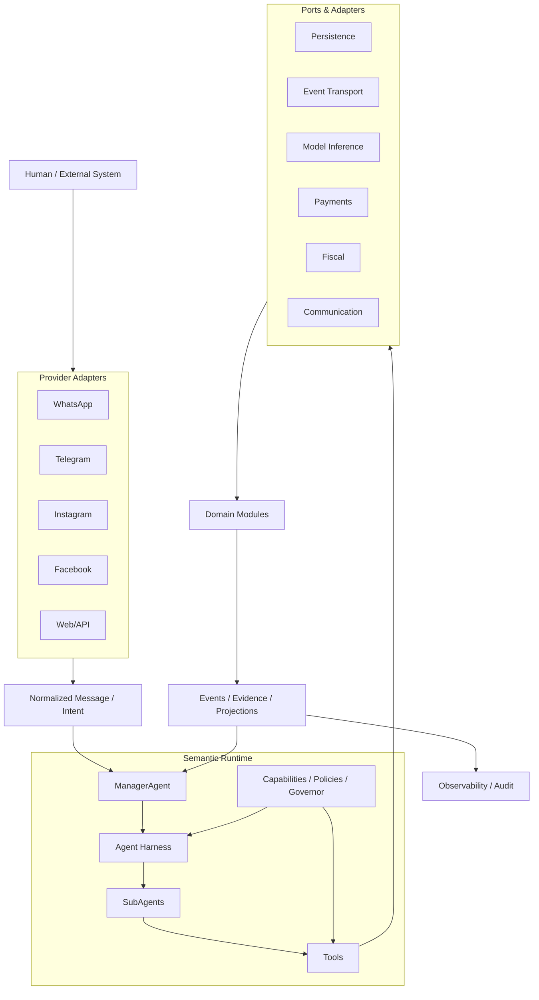

# AllasCode: Semantic-as-Code e Arquitetura Orientada a Intenção para Sistemas Agentivos Governados, Autocorretivos e Auditáveis

**Versão de pesquisa — 2026**  
**Projeto:** AllasCode / AllasCode-Blueprint  
**Status:** descrição arquitetural + agenda experimental; não representa ainda evidência empírica de superioridade.

## Resumo

Sistemas empresariais baseados em agentes de inteligência artificial introduzem um conflito entre autonomia operacional e previsibilidade. Quanto maior a liberdade concedida a um agente para escolher ferramentas, ordenar ações e provocar efeitos externos, maior a superfície para duplicidade, ações não autorizadas, estados inconsistentes e auditoria incompleta. Este artigo apresenta o **AllasCode**, um framework experimental de engenharia de software baseado em **Semantic-as-Code**, **Intent-Driven Development**, **Agent Harness**, grafos de execução explícitos, capabilities, ports, event-driven architecture, self-healing governado e evidência causal.

No AllasCode, intenção, contratos, tipos comportamentais, grafos `.2flow`, Agents, Tools, capabilities, políticas, eventos e evidências são tratados como artefatos versionáveis. Cada módulo funcional possui um único **ManagerAgent**, responsável por coordenar sub-agents e Tools declarados. Tools não recebem autoridade agentiva e não chamam Agents; sub-agents não atravessam diretamente contextos; comunicação entre módulos ocorre por eventos ou Intents; efeitos relevantes utilizam `idempotency_key`, `correlation_id` e `causation_id`; e todas as transições relevantes produzem resultados explícitos `Ok` ou `Error`.

A arquitetura combina ideias clássicas de sistemas distribuídos, Actor Model, Event Sourcing, arquitetura hexagonal, sistemas autonômicos, behavior trees, proveniência, Zero Trust e sistemas multiagentes com avanços recentes em agentes baseados em modelos de linguagem, como ReAct, Toolformer e AutoGen. O artigo descreve os conceitos, a arquitetura polyglot, a DSL 2flow, a organização de módulos, fluxos de compra e venda, comunicação omnichannel, marketing hiperpersonalizado, observabilidade e segurança. Por fim, propõe um protocolo experimental para medir correção, idempotência, latência, recuperação, cobertura semântica, completude de traces e efeitos não autorizados.

**Palavras-chave:** Semantic-as-Code; Intent-Driven Development; sistemas agentivos; multi-agent systems; Agent Harness; event sourcing; self-healing; idempotência; behavior trees; grafos; proveniência; Zero Trust.

---

## Abstract

AI-agent-based enterprise systems introduce a tension between operational autonomy and predictability. The more freedom an agent has to choose tools, order actions and trigger external effects, the larger the surface for duplicate effects, unauthorized actions, inconsistent state and incomplete auditing. This paper presents **AllasCode**, an experimental software-engineering framework based on **Semantic-as-Code**, **Intent-Driven Development**, an explicit **Agent Harness**, execution graphs, capabilities, ports, event-driven architecture, governed self-healing and causal evidence.

In AllasCode, intents, contracts, behavioral types, `.2flow` graphs, Agents, Tools, capabilities, policies, events and evidence are treated as versioned software artifacts. Each functional module owns exactly one **ManagerAgent**, which coordinates declared sub-agents and Tools. Tools do not receive agent authority and do not invoke Agents; sub-agents do not directly cross module boundaries; cross-module communication occurs through events or Intents; relevant effects carry `idempotency_key`, `correlation_id` and `causation_id`; and important execution nodes emit explicit `Ok` or `Error` outcomes.

The architecture combines ideas from distributed systems, the Actor Model, Event Sourcing, hexagonal architecture, autonomic computing, behavior trees, provenance, Zero Trust and multi-agent systems with recent language-model agent work such as ReAct, Toolformer and AutoGen. This paper describes the conceptual model, polyglot architecture, 2flow DSL, modules, purchase and sales flows, omnichannel communication, hyper-personalized marketing, observability and security. It finally proposes an experimental protocol for measuring correctness, idempotence, latency, recovery, semantic coverage, trace completeness and unauthorized effects.

**Keywords:** Semantic-as-Code; Intent-Driven Development; agentic systems; multi-agent systems; Agent Harness; event sourcing; self-healing; idempotency; behavior trees; graphs; provenance; Zero Trust.

---

# 1. Introdução

Agentes baseados em modelos de linguagem ampliaram a capacidade de sistemas computacionais interpretarem objetivos, utilizarem ferramentas e interagirem com ambientes externos. ReAct demonstrou a utilidade de intercalar raciocínio e ação [Yao et al., 2023]; Toolformer investigou modelos capazes de aprender quando utilizar APIs [Schick et al., 2023]; e AutoGen formalizou aplicações baseadas em conversações entre múltiplos agentes [Wu et al., 2023]. Entretanto, esses avanços não eliminam problemas clássicos de engenharia de software distribuído: causalidade, duplicidade, retries, falhas parciais, autorização, transações, provenance e limites de contexto.

Lamport demonstrou que sistemas distribuídos precisam raciocinar sobre precedência causal sem depender de um relógio global perfeito [Lamport, 1978]. Em sistemas empresariais atuais, essa dificuldade aparece de forma concreta: um webhook pode chegar duas vezes; uma chamada externa pode executar e perder a resposta; duas mensagens podem chegar fora de ordem; um pagamento pode ser confirmado mais de uma vez; um agente pode interpretar duas vezes a mesma intenção.

O AllasCode parte da hipótese de que a autonomia agentiva deve ser separada da autoridade operacional. Um agente pode raciocinar sobre uma tarefa sem, por isso, ganhar permissão irrestrita para modificar estoque, financeiro, identidade, fiscal ou comunicação. Essa distinção inspira a arquitetura apresentada neste trabalho.

A contribuição arquitetural proposta pode ser sintetizada na seguinte hipótese:

> **Sistemas agentivos empresariais tornam-se mais previsíveis, auditáveis e resilientes quando liberdade operacional é limitada por semântica executável, grafos explícitos, capabilities, idempotência, causalidade e evidência verificável.**

Esta hipótese ainda deve ser testada experimentalmente. O estado atual do projeto permite descrever uma arquitetura implementada e formular métricas, mas não autoriza afirmar superioridade empírica sobre frameworks agentivos ou arquiteturas tradicionais.

---

# 2. Trabalhos relacionados

## 2.1 Sistemas distribuídos, causalidade e idempotência

O trabalho de Lamport sobre clocks lógicos é uma base para raciocinar sobre causalidade em sistemas distribuídos [Lamport, 1978]. O AllasCode não implementa clocks de Lamport como requisito universal, porém usa explicitamente `correlation_id` e `causation_id` para preservar relações entre eventos, intenções e efeitos.

O RFC 9110 formaliza a semântica de idempotência para operações HTTP [Fielding, Nottingham e Reschke, 2022]. No AllasCode, a ideia é estendida ao domínio: repetir a mesma operação lógica não deve produzir um segundo efeito empresarial.

Helland argumenta que sistemas distribuídos de longa duração precisam sobreviver sem depender de transações globais ACID [Helland, 2007]. A arquitetura AllasCode assume esse problema e utiliza idempotência, eventos, reconciliação e healing em vez de imaginar atomicidade distribuída universal.

## 2.2 Event Sourcing, logs e reconstrução

Event Sourcing preserva mudanças de estado como uma sequência de fatos reaplicáveis [Fowler, 2005]. Kafka mostrou a utilidade de logs persistentes para sistemas distribuídos e processamento de streams [Kreps, Narkhede e Rao, 2011]. O AllasCode utiliza eventos imutáveis, projections, replay e reconstrução em vários componentes, mantendo separação entre modelos de escrita e leitura quando isso agrega valor.

## 2.3 Actor Model

O Actor Model, introduzido por Hewitt, Bishop e Steiger [1973], oferece uma abstração de componentes isolados que processam mensagens. O AllasCode utiliza o princípio de isolamento de estado e supervisão como inspiração para Agents e runtimes concorrentes. Um Agent não deve compartilhar estado mutável de forma arbitrária; comunicação ocorre por mensagens, Intents, eventos ou ports.

## 2.4 Sistemas autonômicos e self-healing

Kephart e Chess formularam a visão de Autonomic Computing [2003], posteriormente consolidada em arquiteturas MAPE-K: Monitor, Analyze, Plan, Execute sobre Knowledge. O framework Rainbow apresentou adaptação arquitetural explícita e reutilizável [Garlan et al., 2004]. O AllasCode adota uma interpretação conservadora de self-healing: uma falha não autoriza comportamento oculto. Healing deve ser explícito, observável, policy-constrained e revalidado.

A noção também guarda relação com self-stabilization, formalizada por Dijkstra [1974], na qual sistemas podem convergir para estados válidos após perturbações. AllasCode não promete self-stabilization formal, mas compartilha o objetivo de convergência para invariantes válidas.

## 2.5 Behavior Trees

Behavior Trees foram amplamente utilizadas em jogos e robótica para representar comportamento modular e reativo. Marzinotto et al. [2014] discutem composição formal e uso em robótica. Colledanchise e Ögren [2018] sistematizam a técnica. No AllasCode, Behavior Trees não substituem o grafo semântico global; elas podem ser uma projeção executável local para sequências, selectors, fallback e recovery.

## 2.6 Agentes de linguagem e Tools

ReAct [Yao et al., 2023], Toolformer [Schick et al., 2023] e AutoGen [Wu et al., 2023] evidenciam que modelos de linguagem podem planejar, agir e utilizar ferramentas. O diferencial proposto pelo AllasCode não é a existência de Tools, mas **governar quem pode utilizá-las, em qual contexto, por qual grafo e com qual evidência**.

## 2.7 Proveniência e semântica

RDF representa relações identificáveis na Web Semântica [W3C, 2014]. PROV define entidades, atividades, agentes e relações de provenance [W3C, 2013]. AllasCode não exige RDF ou PROV, mas compartilha a preocupação de tornar significado e causalidade explicitamente representáveis.

## 2.8 Segurança Zero Trust

NIST SP 800-207 define Zero Trust Architecture como um modelo que elimina confiança implícita baseada apenas em localização de rede [Rose et al., 2020]. AllasCode aplica essa ideia a sessões, Agents, Tools e serviços: identidade autenticada não equivale a capability; contexto e força de autenticação também são avaliados.

---

# 3. Princípios fundamentais do AllasCode

## 3.1 All as Code

O termo **All as Code** expressa a decisão de versionar não apenas implementação, mas arquitetura, regras, schemas, políticas, eventos, fluxos, capacidades, testes e evidências.

Um módulo deve evitar configuração escondida dentro do código quando o comportamento deveria ser configurável. A meta é que alterar arquitetura ou policy implique alterar artefatos declarativos revisáveis.

## 3.2 Semantic-as-Code

No AllasCode, semântica significa significado operacional verificável.

Seja:

\[
\Sigma = (I, A, T, G, C, P, E, R)
\]

onde:

- \(I\): Intents;
- \(A\): Agents;
- \(T\): Tools/Actions;
- \(G\): grafos de execução;
- \(C\): capabilities;
- \(P\): policies e ports;
- \(E\): eventos/evidências;
- \(R\): contratos de resultado.

Uma mudança arquitetural relevante é uma mudança em \(\Sigma\), logo pode ser detectada por semantic diff, testes e CI.

## 3.3 Intent-Driven Development

O desenvolvimento começa pela intenção e pelo caminho necessário para concretizá-la, antes da escolha de frameworks, classes ou tabelas.

Uma intenção pode ser representada como:

\[
I = \langle actor, context, goal, constraints, evidence, correlation \rangle
\]

O fluxo é modelado primeiro; entidades, Actions, eventos e persistência emergem a partir dele.

Exemplo:

```text
Comerciante compra produtos
  -> envia áudio/foto/comprovante
  -> sistema interpreta
  -> identifica fornecedor e produtos
  -> registra compra
  -> entra no estoque
  -> registra despesa
  -> gera documento fiscal quando aplicável
```

O caminho contrário:

```text
maquininha identifica venda
  -> sistema pergunta quais produtos foram vendidos
  -> comerciante responde por WhatsApp
  -> sistema resolve produtos
  -> baixa estoque
  -> fecha venda
  -> registra receita/pagamento
```

## 3.4 Semantic AtomicBehavior Types

O framework diferencia tipo de valor de **tipo comportamental**. Um AtomicBehavior não é identificado apenas pelo tipo estático de entrada, mas por como tenta validar, transformar, normalizar ou rejeitar um valor.

Um valor só é aceito depois de satisfazer o comportamento esperado. Transformações utilizadas em validate/healing devem preservar reversibilidade quando a arquitetura exigir recuperação ou prova do valor original.

## 3.5 Resultados binários: Ok e Error

Actions e Tools emitem dois resultados semânticos universais:

```text
Ok<T>
Error<E>
```

`Error` não significa necessariamente falha terminal. Ele pode disparar healing, solicitar nova evidência ou escalar para humano.

Essa redução evita dezenas de canais implícitos de retorno e favorece composição uniforme.

## 3.6 Normalização explícita

Normalização não deve ocorrer silenciosamente em qualquer camada. No modelo AllasCode, normalização pertence principalmente a:

- `validate`;
- `self-healing`.

Isso evita que um valor seja alterado sem que exista evidência de transformação.

---

# 4. Modelo de Agents

## 4.1 Agent como utilizador governado

Um Agent é tratado como um utilizador computacional do sistema. Ele possui contexto, identidade, capabilities e limites. Conhecimento não implica autoridade.

## 4.2 ManagerAgent por módulo

Cada módulo possui **exatamente um ManagerAgent**. Ele é o único Agent que conhece a topologia interna do módulo e pode coordenar sub-agents.

Formalmente:

\[
M_m : I_m \times S_m \rightarrow A_m^*
\]

onde \(M_m\) é o ManagerAgent do módulo \(m\), e \(A_m^*\) é uma sequência permitida de operações internas.

Regras:

1. um ManagerAgent por módulo;
2. sub-agent não chama Agent de outro módulo;
3. Tool não chama Agent;
4. ManagerAgent não chama diretamente ManagerAgent de outro módulo;
5. fronteira entre módulos usa eventos/Intents;
6. cada chamada preserva contexto e causalidade.

## 4.3 Sub-agents

Sub-agents recebem uma visão limitada do contexto. Eles executam especializações como interpretação, scoring, validação ou planejamento local.

## 4.4 Tools

Tools encapsulam capabilities externas ou operações específicas.

```ts
type ToolResult<T, E> =
  | { kind: 'Ok'; value: T }
  | { kind: 'Error'; error: E }
```

Uma Tool não decide um novo objetivo. Ela executa o contrato declarado.

## 4.5 Agent Harness

O Agent Harness separa fases de execução:

```text
AgentHarness.prepare
AgentHarness.invoke
AgentHarness.observe
AgentHarness.evaluate
AgentHarness.finalize
```

Uma invocação carrega:

```ts
interface AgentInvocation<T> {
  agent_id: string
  context_id: string
  correlation_id: string
  causation_id: string
  idempotency_key: string
  deadline_at: string
  required_capability: string
  payload: T
}
```

O Harness não é um “super-agent”. Ele não ganha acesso oculto ao domínio.

---

# 5. Grafos, Behavior Trees e a DSL 2flow

## 5.1 Grafo como topologia global

O grafo semântico responde:

- quais entidades existem;
- quais Agents podem receber quais Intents;
- quais Tools são permitidas;
- quais eventos conectam módulos;
- quais pré-condições e invariantes governam efeitos.

## 5.2 Behavior Tree como projeção executável local

Uma Behavior Tree pode decidir sequência, fallback, retry autorizado e recuperação local. O grafo continua sendo a topologia global.

Assim:

```text
Semantic Graph = onde pode ir
Behavior Tree  = como executar localmente
Policies       = sob quais condições
Evidence       = por que ocorreu
```

## 5.3 Sintaxe 2flow

A DSL utiliza direção visual consistente:

```text
->   evento/informação entrando
<-   evento/informação saindo
->>  chamada
<<-  sendo chamado
[]   paralelo
```

Exemplo:

```2flow
-> PurchaseIntent

PurchaseManagerAgent
  ->> PurchaseInterpretationAgent

PurchaseInterpretationAgent
  ->> EvidenceReadTool
    <- Ok | Error

PurchaseManagerAgent
  ->> PurchaseCommitAgent

PurchaseCommitAgent
  ->> PurchaseRepositoryTool
    <- Ok | Error

PurchaseManagerAgent
  <- Purchase.Ok | Purchase.Error
```

## 5.4 Regra de fronteira

Incorreto:

```text
SalesSubAgent ->> FinancialSubAgent
```

Correto:

```text
SalesManagerAgent
  <- SaleClosed.Ok

-> FinancialIntent
FinancialManagerAgent
```

---

# 6. Self-healing governado

## 6.1 Healing explícito

Uma política de healing pode ser definida como:

\[
H(failure,evidence,policy,state) \rightarrow recovery
\]

sujeita a:

\[
recovery \in Allowed(policy, capability, graph)
\]

Healing não significa retry infinito. O pipeline recomendado é:

```text
detect
  -> preserve evidence
  -> classify
  -> choose authorized repair
  -> execute idempotently
  -> validate again
  -> finalize or escalate
```

## 6.2 Human-in-the-Healing-Loop

Quando a transformação não é segura, o sistema solicita nova evidência humana.

Exemplo:

```text
Venda de R$ 42,00 identificada
  -> produtos desconhecidos
  -> WhatsApp pergunta ao comerciante
  -> humano informa os produtos
  -> nova evidência
  -> validação
  -> baixa de estoque
```

O sistema não precisa “retornar erro” para o usuário final; internamente, entretanto, o estado continua explicitamente `Error` até existir evidência suficiente.

## 6.3 Reversibilidade

Correções automáticas devem preferir transformações reversíveis e guardar o valor anterior. Isso permite auditar:

```text
original -> normalization -> validated
```

sem perder o original.

---

# 7. Arquitetura de runtime

O runtime conceitual segue:

```text
Intake
  -> Resolver
  -> Binding
  -> Healing
  -> Proof
  -> Governor
  -> Orchestration
  -> Acceptance
  -> Persistence
```

### Intake
Recebe Intent/evento normalizado.

### Resolver
Determina contexto semântico, entidade e ação provável.

### Binding
Liga valores de entrada a interfaces/schemas esperados.

### Healing
Resolve divergências recuperáveis.

### Proof
Gera/valida evidências necessárias.

### Governor
Verifica capability, policy, autorização e invariantes.

### Orchestration
Executa grafo/BT/Agents/Tools.

### Acceptance
Verifica se o resultado satisfaz o contrato.

### Persistence
Registra estado, eventos, idempotência e evidência.

---

# 8. Ports, adapters e arquitetura hexagonal

O domínio não conhece APIs concretas. Dependências externas são ports.

```text
Domain / Actions
      ↓
     Port
      ↓
 Adapter
      ↓
Provider / DB / Queue / LLM
```

Isso é compatível com a arquitetura hexagonal de Cockburn [2005].

Exemplos:

```text
PersistencePort
EventTransportPort
FiscalProviderTool
CommunicationProviderPort
PaymentProviderPort
ModelInferencePort
```

---

# 9. Persistência, CQRS e Event Sourcing

## 9.1 Transaction boundary

A transação lógica agrupa:

```text
idempotency check
+ entity write
+ event append
```

## 9.2 Replay

Eventos preservam IDs originais e podem reconstruir projections.

## 9.3 CQRS

O projeto permite separar escrita e leitura. Por exemplo:

```text
Write model -> Postgres / Event Store
Read model  -> MongoDB / projections
Cache       -> Redis
Graph       -> Neo4j
Vector      -> Qdrant
Logs        -> ClickHouse
Trace       -> Tempo/OpenTelemetry
```

Essa distribuição é configurável e não obrigatória para todo módulo.

## 9.4 Arquitetura fluida / polyglot

Uma entidade simples pode usar um stack mais leve; outra pode exigir actors, microservices, serverless ou event sourcing. A arquitetura é composicional, não monolítica.

---

# 10. Mensageria

## 10.1 In-memory

Quando produtor e consumidor vivem no mesmo processo, mensageria em memória reduz serialização, syscalls e hops de rede.

## 10.2 Distribuída

Quando o efeito atravessa processo, host ou região, adapters como NATS/QUIC/Kafka podem assumir transporte.

O princípio é:

```text
local -> in-memory
remote -> network transport
```

sem alterar o contrato semântico.

## 10.3 Delivery guarantees

O Event Bus implementa:

- ordering por `ordering_key`;
- retry limitado;
- deduplicação por `idempotency_key`;
- replay;
- falha terminal explícita.

---

# 11. Idempotência e causalidade

Para uma chave lógica \(k\):

\[
f(f(x,k),k)=f(x,k)
\]

No domínio:

\[
count(effect(k)) \le 1
\]

Identificadores comuns:

```text
event_id
correlation_id
causation_id
idempotency_key
ordering_key
context_id
```

`correlation_id` agrupa uma jornada; `causation_id` liga causa e efeito. Essa disciplina se relaciona ao problema clássico de causalidade distribuída [Lamport, 1978] e aos padrões modernos de Trace Context do W3C.

---

# 12. Evidência, observabilidade e prova

## 12.1 Evidence Envelope

```ts
interface EvidenceEnvelope<T> {
  evidence_id: string
  correlation_id: string
  causation_id: string
  actor_id: string
  action: string
  observed_at: string
  input_digest: string
  output_digest?: string
  policy_decision?: 'allow' | 'deny'
  payload: T
}
```

## 12.2 Observabilidade adaptativa

Nem todo contexto exige o mesmo custo de observação. Uma operação de leitura pode gerar menos evidência que uma ação fiscal ou financeira.

A proposta de **Adaptive Observability Negotiation** é ajustar a quantidade de traces, logs e proofs ao risco e ao contexto.

## 12.3 OpenTelemetry

OpenTelemetry fornece uma base adequada para traces, metrics e logs distribuídos, enquanto `correlation_id` e `causation_id` preservam semântica de domínio.

---

# 13. Segurança e autorização

## 13.1 Sessões

Uma sessão contém:

```text
principal
role
capabilities
context_id
auth_strength
expires_at
```

## 13.2 Authorization Gate

```text
active session?
  -> same context?
  -> capability?
  -> strong auth when sensitive?
  -> protected Action
```

## 13.3 Cross-context

Mutações entre tenants/contextos são bloqueadas explicitamente.

## 13.4 Zero Trust

O modelo segue o princípio do NIST SP 800-207: nenhuma confiança implícita por rede ou posição arquitetural. Managers, Harness e Tools continuam sujeitos a autorização.

---

# 14. Comunicação omnichannel

O sistema possui uma camada normalizada para:

```text
WhatsApp
Telegram
Instagram
Facebook Messenger
TikTok (capability-dependent)
```

Mensagem normalizada:

```ts
interface NormalizedInboundMessage {
  provider: string
  account_id: string
  conversation_id: string
  sender_id: string
  provider_message_id: string
  kind: 'text' | 'image' | 'audio' | 'document' | 'video'
  idempotency_key: string
  correlation_id: string
  raw: unknown
}
```

O adapter preserva diferenças reais. Se um provider não oferece uma capability outbound equivalente, o sistema retorna `UnsupportedCapability`; não simula suporte inexistente.

---

# 15. Marketing hiperpersonalizado

Marketing é um bounded context de leitura/projeção que consome dados permitidos de cliente, vendas, produtos e estoque para produzir:

- segmentos;
- afinidade produto-cliente;
- campanhas;
- ofertas;
- canais recomendados;
- frequência de contato.

Antes do envio:

```text
profile projection
 -> scoring
 -> consent policy
 -> frequency cap
 -> channel capability
 -> CommunicationIntent
```

O princípio ético é:

\[
canPredict(user) \neq mayContact(user)
\]

Alta probabilidade de conversão não é autorização para contato.

---

# 16. Módulos comerciais implementados

## 16.1 Purchase

- evidências via UI/WhatsApp;
- áudio/imagem/documento;
- identificação de fornecedor;
- produtos/quantidades/preços;
- associação a estoque e financeiro.

## 16.2 Sales

- venda identificada;
- resolução dos produtos vendidos;
- healing conversacional;
- baixa idempotente de estoque;
- fechamento financeiro.

## 16.3 Inventory

- ledger;
- entradas;
- saídas;
- ajustes;
- mínimo;
- reconciliação;
- prevenção de duplicidade.

## 16.4 Financial

- receitas/despesas;
- pagamentos;
- estados pending/confirmed/failed/refunded/cancelled;
- cash flow;
- reconciliation.

## 16.5 Customer

- identidade canônica;
- telefone/WhatsApp/email;
- deduplicação;
- histórico comercial;
- privacy capabilities.

## 16.6 Supplier

- cadastro;
- resolução por evidência;
- compras e produtos;
- histórico de custos.

## 16.7 Fiscal

- FiscalProviderTool;
- elegibilidade;
- emissão idempotente;
- status;
- timeout/rejeição;
- healing.

## 16.8 Accounting

Projection read-only de:

- revenue;
- expense;
- COGS;
- gross margin;
- inventory valuation;
- cash position.

## 16.9 Communication

Providers normalizados e contratos inbound/outbound.

## 16.10 Marketing

Segmentação e campanhas governadas.

## 16.11 Auth

Sessões, roles, capabilities, step-up e cross-context isolation.

## 16.12 AgentHarness

Execução governada de Agents.

---

# 17. Arquitetura polyglot

Uma configuração de referência do AllasCode distribui responsabilidades por linguagens:

| Responsabilidade | Tecnologia/Linguagem de referência |
|---|---|
| UI | TypeScript |
| Types/Formalization | Haskell |
| Legal/Rules | Prolog |
| AI local | Mojo/Python |
| Effects | Koka |
| Linear resources | Austral |
| Actors | Gleam |
| Media/Buffer | Zig |
| Crypto | Rust |
| Gateway | Go |

Essa divisão é um **design target**, não uma obrigação universal. O objetivo é escolher propriedades de linguagem que reforcem a responsabilidade da camada.

---

# 18. Estrutura semântica dos módulos

A convenção central utiliza:

```text
README.md
manifest.yml
config.yml
interface/schema
```

### README
Explica significado e uso em linguagem natural.

### manifest.yml
Declara identidade e o que o módulo expõe para fora.

### config.yml
Declara valores internos necessários para instanciação.

### interface/schema
Declara tipos que ligam os valores de config e manifest.

Outras pastas:

```text
agents/
actions/
atomicbehavior/
capabilities/
contexts/
entities/
events/
flows/
intents/
policies/
protocols/
schemas/
specifications/
tests/
types/
```

---

# 19. Exemplo completo de uso

## 19.1 Entrada de compra

Usuário envia:

```text
“Comprei 20 caixas de leite do fornecedor ACME por R$180. Segue o comprovante.”
```

O provider gera mensagem normalizada:

```json
{
  "provider": "whatsapp",
  "provider_message_id": "wamid...",
  "idempotency_key": "whatsapp:store-1:wamid...",
  "correlation_id": "purchase:01J...",
  "kind": "text"
}
```

Depois:

```2flow
-> RegisterPurchaseIntent

PurchaseManagerAgent
  ->> PurchaseInterpretationAgent

PurchaseInterpretationAgent
  ->> EvidenceReadTool
    <- Ok | Error
  ->> SupplierLookupTool
    <- Ok | Error

PurchaseManagerAgent
  ->> PurchaseCommitAgent

PurchaseCommitAgent
  ->> PurchaseRepositoryTool
    <- Ok | Error
  ->> InventoryIntentTool
    <- Ok | Error
  ->> FinancialIntentTool
    <- Ok | Error

PurchaseManagerAgent
  <- Purchase.Ok | Purchase.Error
```

## 19.2 Healing

Se preço unitário ou produto forem ambíguos:

```text
Purchase.Error
 -> HealingIntent
 -> ask user
 -> new evidence
 -> validate
 -> resume
```

## 19.3 Venda

```2flow
-> SaleIdentified

SalesManagerAgent
  ->> SaleResolutionAgent

SaleResolutionAgent
  ->> CommunicationQuestionTool
    <- Ok | Error

-> SaleProductsConfirmed

SalesManagerAgent
  ->> InventoryExitTool
    <- Ok | Error
  ->> FinancialSaleTool
    <- Ok | Error

SalesManagerAgent
  <- SaleClosed.Ok | SaleClosed.Error
```

---

# 20. Fluxo geral da arquitetura



---

# 21. Propriedades arquiteturais desejadas

## 21.1 Isolation

\[
SubAgent_m \not\rightarrow SubAgent_n, \quad m \ne n
\]

## 21.2 Capability safety

\[
execute(tool, agent) \Rightarrow required(tool) \subseteq capabilities(agent)
\]

## 21.3 Idempotência

\[
count(effect(k)) \le 1
\]

## 21.4 Causalidade

Todo efeito relevante deve ser rastreável a uma causa:

\[
Effect \rightarrow causation \rightarrow Intent/Event
\]

## 21.5 Explicit failure

Cada nó relevante possui saída `Ok` ou `Error`.

---

# 22. CI semântico

A CI do projeto não valida apenas compilação. Ela inclui etapas como:

```text
Validate
SemanticImpact
SelectorConfidence
SemanticPrDiff
SemanticMergeGate
SelectiveSemanticTests
SemanticCiPolicy
ActionTests
ArchitectureTests
EvidenceFreshness
SemanticReleaseGate
CoreTests
Demo
```

O objetivo é aproximar merge de uma propriedade:

\[
merge(change) \Rightarrow syntax \land architecture \land semantics \land tests
\]

Mutation testing é necessário para comprovar que o gate realmente detecta violações.

---

# 23. Metodologia experimental proposta

A avaliação deve comparar pelo menos duas condições:

### A — agente com acesso direto a Tools

### B — ManagerAgent + 2flow + Harness + capability + evidence

Mesmos cenários, mesmo modelo, mesma temperatura e mesmo orçamento de tokens.

Métricas:

| Dimensão | Métrica |
|---|---|
| Correção | Invariant Violation Rate |
| Idempotência | Duplicate Effect Rate |
| Autorização | Unauthorized Effect Rate |
| Recuperação | Recovery Success Rate |
| MTTR | tempo até estado consistente |
| Latência | p50/p95/p99 |
| Observabilidade | Trace Completeness |
| Semântica | Semantic Scenario Coverage |
| Testes | Mutation Score |

## 23.1 Fault injection

Falhas devem ser injetadas:

```text
antes da Tool
depois da Tool / antes da resposta
durante persistência
após persistência / antes de evidence
durante publicação de evento
durante Provider API
```

Caso crítico:

```text
external effect succeeded
+
response was lost
```

## 23.2 Teste de duplicidade

```python
for _ in range(100):
    deliver_same_event(event)

assert count_business_effects(event.idempotency_key) == 1
```

## 23.3 Mutation testing semântico

Mutações propostas:

```text
remove capability check
Tool -> Agent
ManagerA -> ManagerB
remove idempotency key
break causation id
remove evidence.finalize
duplicate Tool invocation
```

A CI deveria rejeitar todas.

---

# 24. Limitações

## 24.1 Semântica não elimina ambiguidade

Nomes como `PurchaseIntent` ainda dependem de ontologia de domínio coerente.

## 24.2 ManagerAgent pode centralizar demais

Um Manager muito grande pode se tornar gargalo. Métricas de fan-out, profundidade e tamanho de grafo devem ser acompanhadas.

## 24.3 Harness adiciona custo

Capabilities, evidence e avaliação acrescentam latência e armazenamento. O ganho de segurança precisa superar esse custo.

## 24.4 LLM continua probabilístico

Mesmo com grafo determinístico, decisões de modelos variam. Benchmarks devem congelar versão, temperature, seed quando suportada e dataset.

## 24.5 Providers mudam

APIs de comunicação evoluem independentemente. Capabilities precisam ser explicitamente versionadas.

## 24.6 Evidência pode aumentar risco de privacidade

Mais auditabilidade pode significar mais retenção de dados. Evidence deve aplicar minimização, retenção e redaction.

---

# 25. Considerações éticas

Marketing e IA não devem converter predição em permissão.

```text
can_predict != may_contact
```

Campanhas devem respeitar consentimento, opt-out, frequência e proteção de atributos sensíveis.

O NIST AI RMF [Tabassi, 2023] oferece referência útil para mapear, medir e gerenciar riscos de sistemas de IA.

---

# 26. Roadmap científico

```text
formal semantics of 2flow
  -> static validator
  -> executable state machine
  -> property-based testing
  -> fault injection
  -> semantic mutation testing
  -> reproducible agent benchmark
  -> staging study
  -> longitudinal production study
```

Uma futura semântica operacional pode modelar:

\[
\langle node,state,evidence \rangle
\rightarrow
\langle node',state',evidence' \rangle
\]

permitindo provar propriedades de reachability, capability safety e isolamento.

---

# 27. Conclusão

O AllasCode propõe uma arquitetura em que **capacidade de raciocínio não concede autoridade operacional**. Raciocínio, autorização, execução, observação, avaliação, healing e evidência são responsabilidades distintas.

A arquitetura combina:

- Semantic-as-Code;
- Intent-Driven Development;
- grafos 2flow;
- ManagerAgents;
- sub-agents;
- Tools;
- Agent Harness;
- ports/adapters;
- capabilities;
- Actor Model;
- event-driven architecture;
- CQRS/Event Sourcing;
- self-healing governado;
- observabilidade causal;
- Zero Trust;
- comunicação omnichannel;
- marketing governado.

Há fundamento técnico para investigar essa composição. Contudo, a conclusão científica deve permanecer conservadora: a arquitetura é **plausível, implementável e testável**, mas benefícios de segurança, previsibilidade e resiliência ainda precisam ser medidos por experimentos reproduzíveis.

---

# Referências

1. Berners-Lee, T.; Hendler, J.; Lassila, O. **The Semantic Web.** Scientific American, 2001.
2. Cockburn, A. **Hexagonal Architecture.** 2005.
3. Colledanchise, M.; Ögren, P. **Behavior Trees in Robotics and AI.** CRC Press, 2018.
4. Dijkstra, E. W. **Self-stabilizing systems in spite of distributed control.** Communications of the ACM, 1974.
5. Fielding, R.; Nottingham, M.; Reschke, J. **RFC 9110: HTTP Semantics.** IETF, 2022.
6. Fowler, M. **Event Sourcing.** 2005.
7. Garlan, D.; Cheng, S.-W.; Huang, A.-C.; Schmerl, B.; Steenkiste, P. **Rainbow: Architecture-Based Self-Adaptation with Reusable Infrastructure.** Computer, 2004.
8. Helland, P. **Life beyond Distributed Transactions: an Apostate's Opinion.** CIDR, 2007.
9. Hewitt, C.; Bishop, P.; Steiger, R. **A Universal Modular Actor Formalism for Artificial Intelligence.** IJCAI, 1973.
10. Kephart, J. O.; Chess, D. M. **The Vision of Autonomic Computing.** Computer, 2003.
11. Kreps, J.; Narkhede, N.; Rao, J. **Kafka: A Distributed Messaging System for Log Processing.** NetDB, 2011.
12. Lamport, L. **Time, Clocks, and the Ordering of Events in a Distributed System.** Communications of the ACM, 1978.
13. Marzinotto, A.; Colledanchise, M.; Smith, C.; Ögren, P. **Towards a Unified Behavior Trees Framework for Robot Control.** IEEE ICRA, 2014.
14. Rastogi, A.; Zang, X.; Sunkara, S.; Gupta, R.; Khaitan, P. **Towards Scalable Multi-domain Conversational Agents: The Schema-Guided Dialogue Dataset.** AAAI, 2020.
15. Rose, S.; Borchert, O.; Mitchell, S.; Connelly, S. **Zero Trust Architecture.** NIST SP 800-207, 2020.
16. Schick, T. et al. **Toolformer: Language Models Can Teach Themselves to Use Tools.** NeurIPS, 2023.
17. Tabassi, E. **Artificial Intelligence Risk Management Framework (AI RMF 1.0).** NIST AI 100-1, 2023.
18. W3C. **PROV-DM: The PROV Data Model.** 2013.
19. W3C. **RDF 1.1 Concepts and Abstract Syntax.** 2014.
20. W3C. **Trace Context.** W3C Recommendation.
21. Wu, Q. et al. **AutoGen: Enabling Next-Gen LLM Applications via Multi-Agent Conversation.** arXiv:2308.08155, 2023.
22. Yao, S. et al. **ReAct: Synergizing Reasoning and Acting in Language Models.** ICLR, 2023.

A bibliografia completa e URLs/DOIs estão em [`references.bib`](./references.bib).
